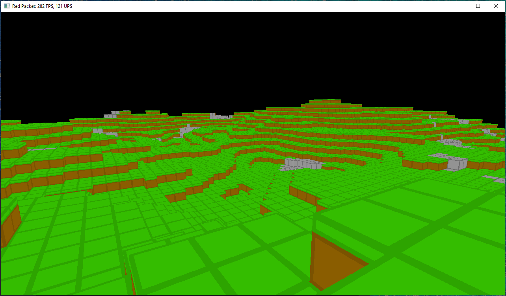

# Red Packet

A game (and engine) written in Java using LWJGL. Heavily inspired by the [lwjglgamedev][lwjglgamedev] book.

 Screenshot of the game so far

## Features

Some features I've implemented so far, and some more for the future.

- [x] Chunks
    - [x] Cubes
    - [x] Chunks with multiple cubes
- [ ] Textures
    - [x] Basic textured blocks
    - [x] Multiple textures per block (different faces)
    - [ ] HD textures (instead of programmer art!)
- [ ] World generation
    - [x] Simple random terrain generator
    - [x] OpenSimplex noise generator
    - [ ] Trees
    - [ ] Caves
- [ ] Entities
    - [ ] Complex models
    - [ ] AI movement
- [ ] Environment
    - [ ] Lighting
    - [ ] Water shaders
    - [ ] Sky box
    - [ ] Clouds
- [ ] Audio
    - [ ] Music
    - [ ] Block/player sounds
    - [ ] Ambient noises
- [ ] Networking
    - [ ] Multiplayer

[lwjglgamedev]: https://ahbejarano.gitbook.io/lwjglgamedev/
